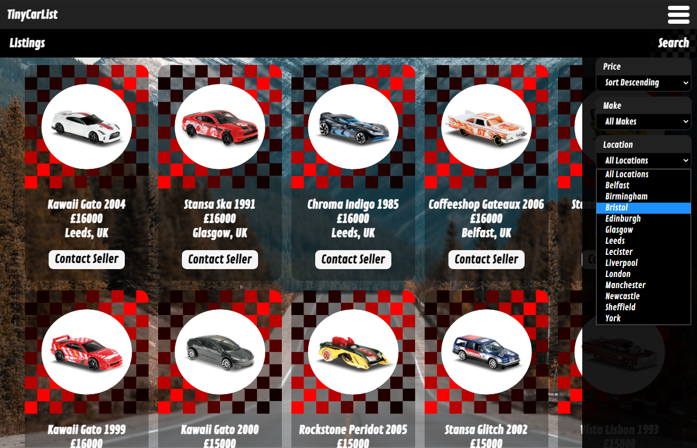
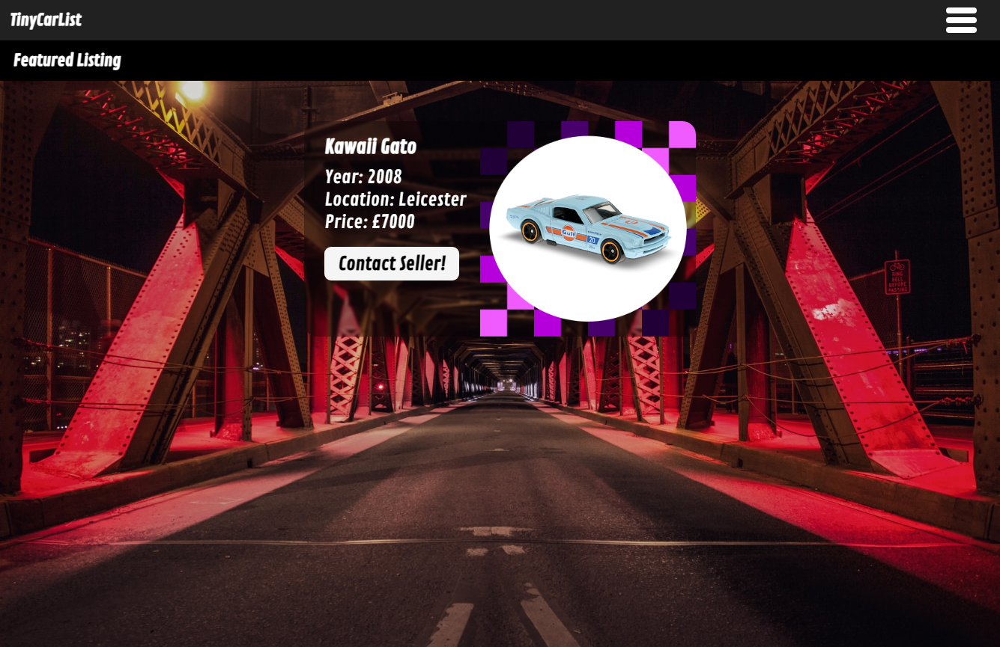
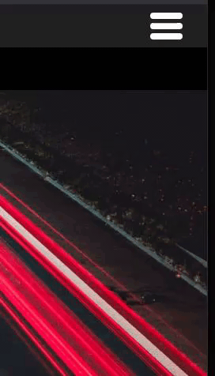

# TinyCarList 🛣️

## Background

This application is a full-stack automobile trading site.  
The application is spread between two repositories. This repo contains the front-end. The back-end can be found [here](https://github.com/DevArrowsmith/tiny-car-list-api).   
The front-end is hosted on [GitHub Pages](https://devarrowsmith.github.io/tiny-car-list-app/#/). The back-end is hosted on [Heroku](https://dashboard.heroku.com/).

---

## Motivation

I wanted to create a full-stack trading application with a database of items for sale. I wanted to include images of merchandise but this raised the issue of ensuring images were appropriately formatted to display well in resusable components.

I decided to create a listings site for automobiles, using pictures of toy cars in place of real cars. I discovered several collectors' sites that included images of Hotwheels cars in a standardised format, allowing me to generate a pool of assets that could be rendered in procedurally generated components with minimal formatting issues.  

I aimed to include the following features in the front-end:

- Responsive React application
- A splash page with a randomly selected featured car
- A specially styled listing page for the featured car
- A filterable listings page with procedurally generated 'cards' displaying cars for sale
- A nav bar with styled & animated menus, including an animated burger menu
- A form for submitting new listings to the database

The features of the API are detailed in the [back-end repo](https://github.com/DevArrowsmith/tiny-car-list-api). 

---

## Screenshots

  

  

 

---

## Installation

The front-end of this application is hosted on [GitHub Pages](https://devarrowsmith.github.io/tiny-car-list-app/#/NewListing) and can be run from there.  
The back-end is hosted on [Heroku](https://dashboard.heroku.com/). Please see the [back-end repository](https://github.com/DevArrowsmith/tiny-car-list-api) for further information.

To install this repo locally:
1. [Clone](https://docs.github.com/en/github/creating-cloning-and-archiving-repositories/cloning-a-repository) this [repo](https://github.com/DevArrowsmith/tiny-car-list-app).
2. Run npm install from root.
3. To run the repo locally run npm start.

---

## Framework

The front-end was built with [React](https://github.com/facebook/react) and styled with [styled-components](https://styled-components.com/).  
[Axios](https://www.npmjs.com/package/axios) was used to handle HTTP requests.

---

## Next Steps

- Add a facility to upload images with new listings.
- Modify the filters in the listings page to procedurally create selectors from the API data. Currently selectors are hard-coded.
- Modify the 'Contact Seller' buttons so that these direct to a contact form rather than providing the seller's email address.

---

## Credits

This application uses Open Source components. You can find their source code and license information below. Huge thanks to all of the people who contribute to this work ❤️

- Project: [React](https://github.com/facebook/react)  
Copyright (c) Facebook, Inc. and its affiliates.  
License: [MIT](https://github.com/facebook/react/blob/master/LICENSE)

- Project: [styled-components](https://github.com/styled-components/styled-components)  
Copyright (c) 2016-present Glen Maddern and Maximilian Stoiber  
License: [MIT](https://github.com/facebook/react/blob/master/LICENSE)

- Project: [Axios](https://www.npmjs.com/package/axios)   
Copyright (c) 2014-present Matt Zabriskie  
License: [MIT](https://github.com/axios/axios/blob/master/LICENSE)

The front-end of the application is hosted on [GitHub Pages](https://pages.github.com/). 

This application uses assets from the [Hotweheels Collectors website](https://hotwheelscollectors.mattel.com/shop) as mock car images.
- **Hotwheels is a trademark of Mattel.**
- **Mattel uses trademarks with the permission of their respective owners.**
